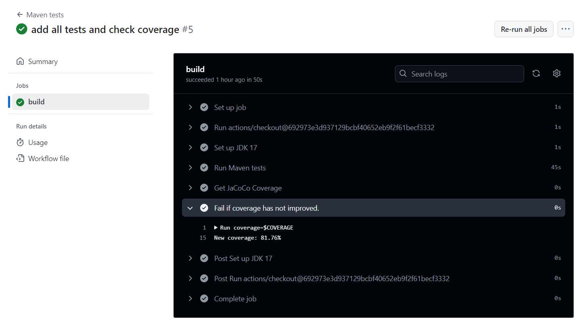
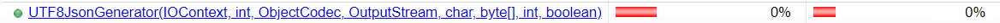
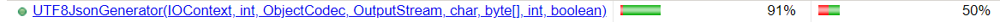
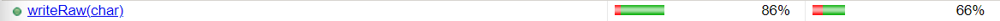
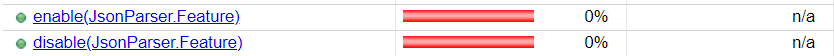
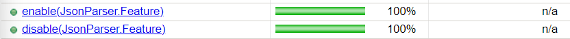
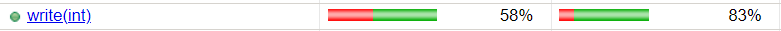
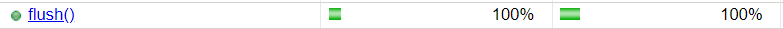
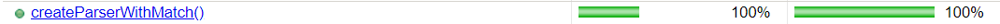

# Tache 2
## Joana da Matta Furtado Ferreira - 20288550
## Songju Lee - 20198117

# Taux de couverture final: 81.76 %  

# Test 1: expandCurrentSegment(int)

Ce test vérifie que la méthode `expandCurrentSegment` augmente correctement la taille du segment actuel dans le `TextBuffer`. Il est important pour garantir que le tampon gère correctement les grandes entrées sans provoquer d'erreurs de mémoire.
  
- [Méthode](../src/main/java/com/fasterxml/jackson/core/util/TextBuffer.java) (ligne 1086)  
- [Test](../src/test/java/com/fasterxml/jackson/core/filter/TextBufferTest.java) (ligne 245)
 
 
 

# Test 2: UTF8JsonGenerator(IOContext ctxt, int features, ObjectCodec codec, OutputStream out, char quoteChar,byte[] outputBuffer, int outputOffset, boolean bufferRecyclable)

Ce test s'assure que le constructeur de `UTF8JsonGenerator` génère correctement une chaîne UTF-8 dans un flux JSON. Il est important pour valider l'encodage UTF-8 et la bonne gestion des flux de sortie, garantissant ainsi une compatibilité avec les données JSON.
 
- [Méthode](../src/main/java/com/fasterxml/jackson/core/json/UTF8JsonGenerator.java) (ligne 149)  
- [Test](../src/test/java/com/fasterxml/jackson/core/write/UTF8GeneratorTest.java) (ligne 162)
 
 
 

# Test 3: writeRaw(char c) 

Ce test vérifie que la méthode `writeRaw` gère correctement un caractère non valide comme "ã" en UTF-8. Cela est essentiel pour éviter les erreurs lors de l'écriture de caractères non supportés, garantissant la robustesse de l'encodage.
 
- [Méthode](../src/main/java/com/fasterxml/jackson/core/json/UTF8JsonGenerator.java) (ligne 794)  
- [Test](../src/test/java/com/fasterxml/jackson/core/write/UTF8GeneratorTest.java) (ligne 190)
 
 
 

# Test 4: writeRaw(char[] text, int offset, int len)

Ce test vérifie que la méthode `writeRaw` gère correctement un tableau de caractères contenant des caractères non valides comme "ã" et "õ". Il est important pour s'assurer que l'application traite les encodages incorrects dans les tableaux de caractères sans provoquer d'erreurs inattendues.
- [Méthode](../src/main/java/com/fasterxml/jackson/core/json/UTF8JsonGenerator.java) (ligne 750)  
- [Test](../src/test/java/com/fasterxml/jackson/core/write/UTF8GeneratorTest.java) (ligne 209)
 
 
 

# Test 5: enable(Feature f) et disable(Feature f)

Ces tests valident que la méthode `enable` et `disable` permettent correctement l'activation et la désactivation d'une Feature dans un délégué JSON. Nous avons testé la fonctionnalité AUTO_CLOSE_SOURCE. Cela est crucial pour garantir que les flux sont bien fermés automatiquement ou manuellement, selon les paramètres, et éviter les fuites de ressources.
- [Méthode](../src/main/java/com/fasterxml/jackson/core/util/JsonParserDelegate.java) (lignes 40 et 46)  
- [Test](../src/test/java/com/fasterxml/jackson/core/util/DelegatesTest.java) (lignes 500 et 519)
  
 
 

# Test 6: write(int c) - caractère invalide

Ce test vérifie que la méthode `write` de `UTF8Writer` lève correctement une exception lorsqu'elle tente d'écrire un caractère invalide. Il est important pour garantir que les erreurs d'encodage sont correctement détectées et gérées.
- [Méthode](../src/main/java/com/fasterxml/jackson/core/io/UTF8Writer.java) (ligne 205)  
- [Test](../src/test/java/com/fasterxml/jackson/core/io/UTF8WriterTest.java) (ligne 168)
  

 

# Test 7: write(String str) - chaîne vide

Ce test vérifie que la méthode `write` de `UTF8Writer` traite correctement l'écriture d'une chaîne vide. Il est important pour s'assurer que le tampon gère les chaînes vides sans provoquer d'erreurs ou de comportements inattendus.
- [Méthode](../src/main/java/com/fasterxml/jackson/core/io/UTF8Writer.java) (ligne 251)  
- [Test](../src/test/java/com/fasterxml/jackson/core/io/UTF8WriterTest.java) (ligne 183)
  

 

# Test 8: flush()

Ce test vérifie que la méthode `flush` de `UTF8Writer` fonctionne correctement en écrivant des données dans le tampon. Il est crucial pour garantir que les données sont correctement transmises et que les appels de `flush` n'entraînent pas de perte d'informations.
- [Méthode](../src/main/java/com/fasterxml/jackson/core/io/UTF8Writer.java) (ligne 88)  
- [Test](../src/test/java/com/fasterxml/jackson/core/io/UTF8WriterTest.java) (ligne 196)
  

 

# Test 9: getMatchStrength()

Ce test vérifie que la méthode `getMatchStrength` de `DataFormatMatcher` renvoie `MatchStrength.INCONCLUSIVE` lorsque le tableau de bytes ne correspond à aucun format connu. Cela est essentiel pour s'assurer que le système ne renvoie pas de résultats incorrects lorsque les données ne correspondent à aucun format valide.
- [Méthode](../src/main/java/com/fasterxml/jackson/core/format/DataFormatMatcher.java) (ligne 81)  
- [Test](../src/test/java/com/fasterxml/jackson/core/format/DataFormatMatcherTest.java) (ligne 79)
  

 

# Test 10: createParserWithMatch()

Ce test vérifie que la méthode `createParserWithMatch` de `DataFormatMatcher` renvoie `null` lorsque le tableau de bytes est vide et ne correspond à aucun format valide. Cela est important pour garantir que le système gère correctement les entrées invalides et ne crée pas de parseurs inutiles.
- [Méthode](../src/main/java/com/fasterxml/jackson/core/format/DataFormatMatcher.java) (ligne 114)  
- [Test](../src/test/java/com/fasterxml/jackson/core/format/DataFormatMatcherTest.java) (ligne 99)
  

 
